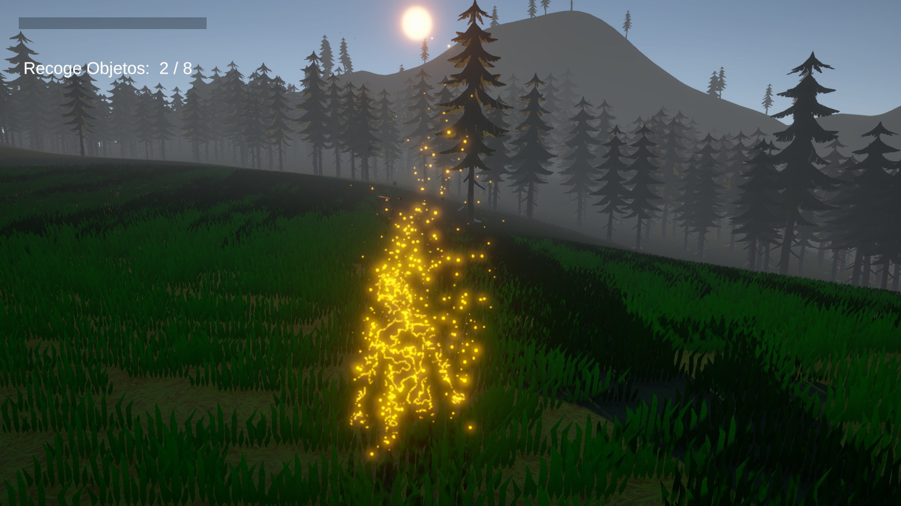
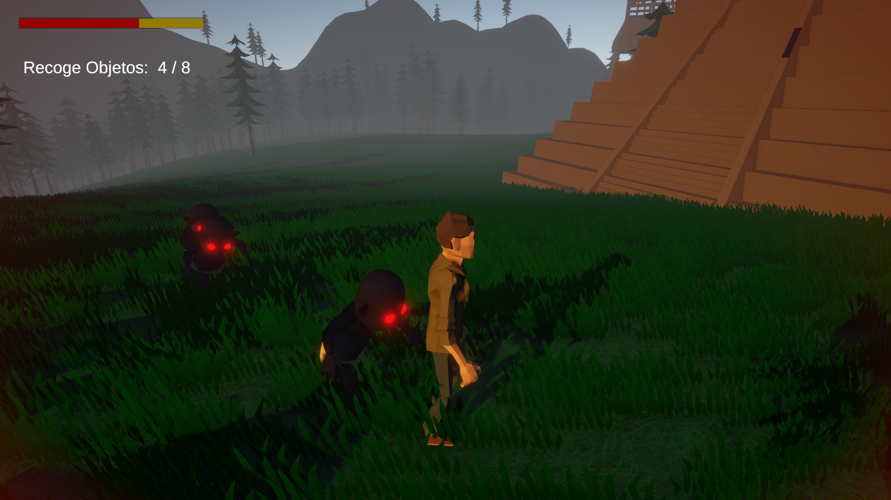
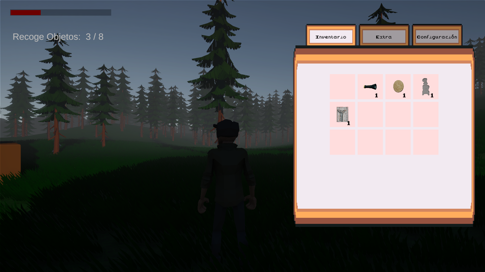
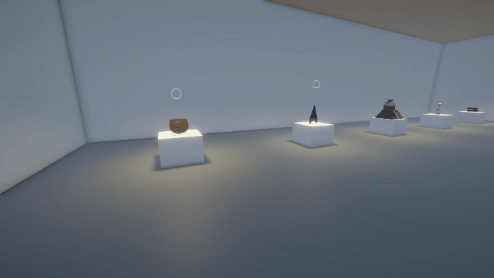
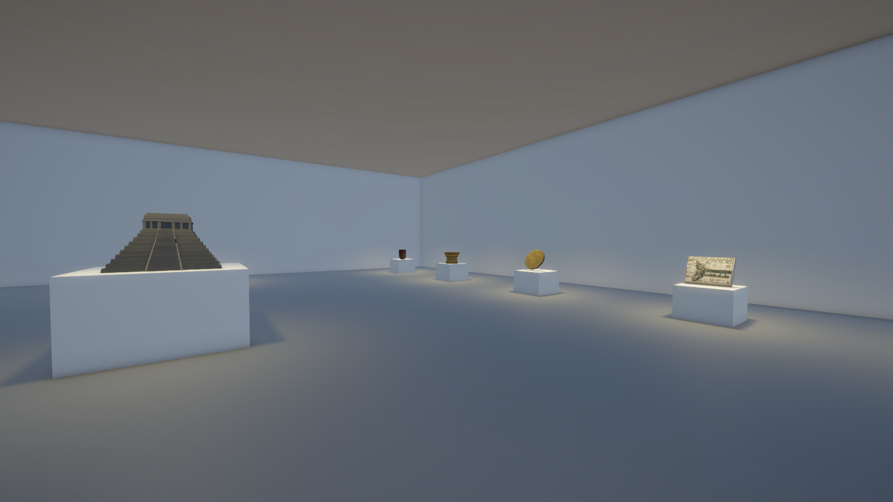

# Unity Interactive Museum Prototype

Unity 6 educational exploration prototype combining an interactive museum scene and artifact collection gameplay, featuring inventory management, objective tracking, interaction systems, and FSM-based enemy AI.

## Table of Contents

- [Overview](#overview)
- [Features](#features)
- [Design Decisions](#design-decisions)
  - [Event-Driven Systems](#event-driven-systems)
  - [Data-Driven Content](#data-driven-content)
  - [FSM Enemy AI](#fsm-enemy-ai)
  - [Dependency Management](#dependency-management)
- [Core Systems](#core-systems)
- [Screenshots](#screenshots)
- [Project Notes](#project-notes)
- [Technology Stack](#technology-stack)
- [Credits](#credits)

---

## Overview

The project was developed over approximately 8 weeks both as an educational presentation piece and a systems-focused learning project. It was built in Unity 6 using C# and emphasizes modular gameplay systems, event-driven communication, and data-driven content.

**Project Status:** Complete prototype

---

## Features

### Museum Experience

- Artifact inspection
- Cultural information display
- Dedicated museum scene

### Gameplay Experience

- Artifact collection
- Objective tracking
- Enemy AI with idle, patrol, chase, and search states
- Throwable offering mechanic
- Health and damage system
- Win/lose conditions
- First-person and third-person camera modes

### Supporting Systems

- Inventory management
- Drag-and-drop inventory UI
- Event-driven communication
- Audio feedback system
- Interaction system

---

## Design Decisions

### Event-Driven Systems

Systems communicate primarily through C# events rather than direct dependencies. Inventory changes notify the objective tracker; objective progress drives UI updates; completion events propagate to the game flow system.

### Data-Driven Content

Items and objectives are defined through ScriptableObjects, keeping content configuration separate from gameplay logic. New artifacts and objective configurations can be added without requiring changes to the existing tracking implementation.

### FSM Enemy AI

Enemy behavior is implemented as a single-class finite state machine with four states: **Idle, Patrol, Chase, Search**. Detection combines OverlapSphere-based perception with raycast visibility checks to simulate field-of-view behavior.

### Dependency Management

Managers are intentionally not implemented as singletons. Serialized references live on prefab-level objects, keeping scene setup minimal and system dependencies explicit. A `PlayerContext` object centralizes player-related system references, allowing external systems to access what they need, inventory, health, UI, without direct dependencies on individual player components.

---

## Core Systems

| System | Key Components | Notes |
|---|---|---|
| Interaction | `IInteractable`, `PlayerInteraction`, `WorldSpaceInteractableIndicator` | Proximity-based, targets closest interactable |
| Inventory | `InventoryController`, `InventoryViewModel`, `InventoryUIController`, `DragAndDrop` | Fixed slots, stackable items, SO-defined item data |
| Objective | `ObjectiveTracker`, `ObjectiveSO`, `Objective` | Data-driven, event-based progress, supports sequencing |
| Enemy AI | `EnemyAIController` | Single-class FSM, OverlapSphere + raycast detection |
| Health | `Health`, `EnemyDamage` | |
| Player | `PlayerInput`, `PlayerViewController`, `PlayerContext` | |
| Audio | `AudioEmitter` | Object-level, reusable across scene prefabs |
| UI | `UIController`, `UIHealthBar`, `ObjectiveUI` | Driven by events from gameplay systems |
| Game Flow | `GameManager` | Initialization, system wiring, state coordination |

---

## Screenshots

### Main Scene

<table align="center">
  <tr>
    <td></td>
    <td></td>
  </tr>
  <tr>
    <td colspan="2" align="center"></td>
  </tr>
</table>

### Museum

<table align="center">
  <tr>
    <td></td>
    <td></td>
  </tr>
</table>

---

## Project Notes

- Developed as a presentation-focused educational prototype
- Approximately 8 weeks of development

---

## Technology Stack

- Unity 6 (6000.3.8f1)
- C#
- Universal Render Pipeline (URP)
- Unity Input System
- Cinemachine
- TextMeshPro

---

## Credits

### Programming, Systems Design & Implementation

- Gabriel Guzmán

### 3D Modeling & Art Direction

- Betzaida Vera
- Cynthia Pérez

### Presentation Opportunity, Academic Coordination & Creative Input

- Maestro Elías Rivera Custodio

### Third-Party Assets

- Synty Studios (Unity Asset Store)
- Polytope Studio (Unity Asset Store)
- QuirkyFishBiscuit (Unity Asset Store)

---